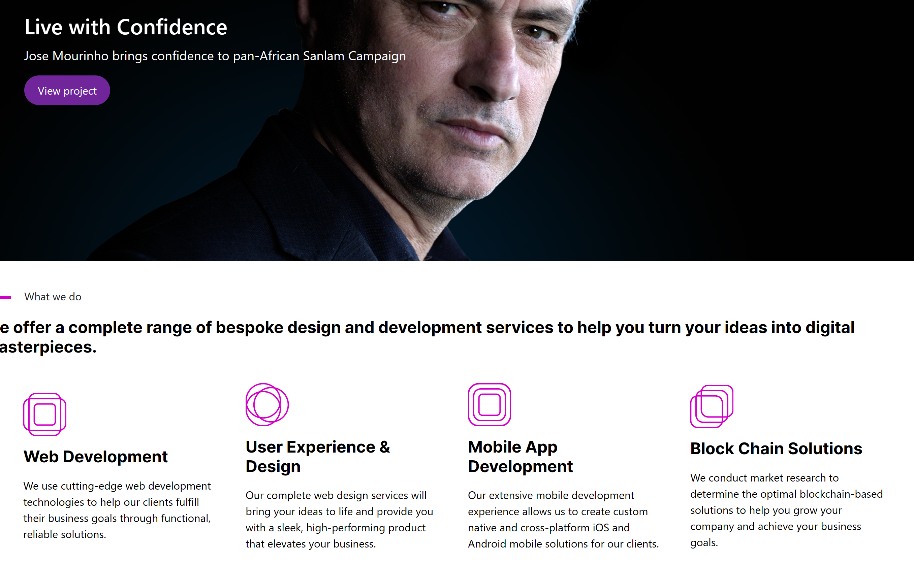

<a name="readme-top"></a>

<div align="center">

  <h3><b>Brands Test Frontend</b></h3>

</div>

<!-- TABLE OF CONTENTS -->

# 📗 Table of Contents

- [📗 Table of Contents](#-table-of-contents)
- [📖 Brands Test Frontend](#-Brands-Test-Frontend-)
  - [🛠 Built With ](#-built-with-)
    - [Tech Stack ](#tech-stack-)
    - [Key Features ](#key-features-)
  - [🚀 Live Demo ](#-live-demo-)
  - [💻 Getting Started ](#-getting-started-)
    - [Prerequisites](#prerequisites)
    - [Setup](#setup)
    - [Install](#install)
    - [Usage](#usage)
    - [Run tests](#run-tests)
  - [👥 Author](#-authors-)
  - [🔭 Future Features ](#-future-features-)
  - [🤝 Contributing ](#-contributing-)
  - [⭐️ Show your support ](#️-show-your-support-)
  - [🙏 Acknowledgments ](#-acknowledgments-)
  - [📝 License ](#-license-)

<!-- PROJECT DESCRIPTION -->

# 📖 Brands Test Frontend <a name="about-project"></a>

**Brand Test Frontend** is a REACT project that converts a Figma design to UI and integrate data from API. The [Brands Test Backend](https://github.com/uchexm/TestBackend) project for Accenture Full stack Interview process.

## 🛠 Built With <a name="built-with"></a>

### Tech Stack <a name="tech-stack"></a>

<details>
  <summary>REACT</summary>
  <ul>
    <li><a href="https://react.dev/">React</a></li>
  </ul>
</details>

<details>
<summary>Redux</summary>
  <ul>
    <li><a href="https://redux.js.org/">Redux</a></li>
  </ul>
</details>

<!-- Features -->

### Key Features <a name="key-features"></a>

- **Create Brands UI**
- **List Services and Brands**
- **Fetch data from API**

<p align="right">(<a href="#readme-top">back to top</a>)</p>

<!-- LIVE DEMO -->

## 🚀 Live Demo <a name="live-demo"></a>

- Coming Soon

<p align="right">(<a href="#readme-top">back to top</a>)</p>

## :camera: Screenshot <a name="Screen-shot"></a>

  

<!-- GETTING STARTED -->

## 💻 Getting Started <a name="getting-started"></a>

To get a local copy up and running, follow these steps.

### Prerequisites

In order to run this project you need:

```sh
  node
  npm
  browser
```

### Setup

Clone this repository to your desired folder:

Example commands:

```sh
  cd your-folder
  git clone https://github.com/uchexm/testfrontend.git
```

### Install

Install this project with:

Example command:

```sh
  cd my-project
  bundle install
```


### Usage

To run the project, execute the following command:

Example command:
```sh
  npm run build
```

```sh
  npm start
```

### Run tests

To run tests, run the following command:

Example command:

```sh
  npm test
```

<p align="right">(<a href="#readme-top">back to top</a>)</p>

<!-- AUTHORS -->

## 👥 Author <a name="authors"></a>

👤 **Uchechi Nwaka**

- GitHub: [](https://github.com/demix007)
- Twitter: [](https://twitter.com/nwakauc)
- LinkedIn: [](https://linkedin.com/in/nwakauc)

<p align="right">(<a href="#readme-top">back to top</a>)</p>

<!-- FUTURE FEATURES -->

## 🔭 Future Features <a name="future-features"></a>

- [x] **Add Login**
- [x] **Add advance tests to all functionality**
- [x] **Enhance cyber security for the frontend**

<p align="right">(<a href="#readme-top">back to top</a>)</p>

<!-- CONTRIBUTING -->

## 🤝 Contributing <a name="contributing"></a>

Contributions, issues, and feature requests are welcome!

Feel free to check the [issues page](https://github.com/uchexm/testfrontend.git/issues).

<p align="right">(<a href="#readme-top">back to top</a>)</p>

<!-- SUPPORT -->

## ⭐️ Show your support <a name="support"></a>

If you like this project please give it a ⭐️. Your support is greatly appreciated!

<p align="right">(<a href="#readme-top">back to top</a>)</p>

<!-- ACKNOWLEDGEMENTS -->

## 🙏 Acknowledgments <a name="acknowledgements"></a>

I would like to thank [Accenture](https://www.accenture.com/us-en/) for giving me this chance to display my expertise in building a Rails API and connect it to a React frontend and for supplying me with the materials.

<p align="right">(<a href="#readme-top">back to top</a>)</p>

<!-- LICENSE -->

## 📝 License <a name="license"></a>

This project is [MIT](./LICENSE) licensed.

<p align="right">(<a href="#readme-top">back to top</a>)</p>